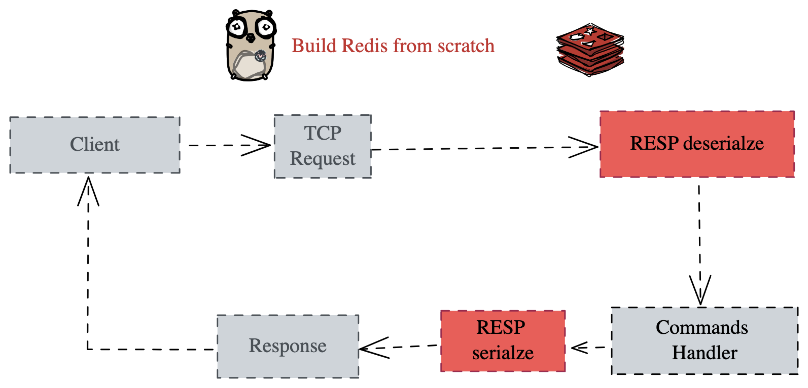

# Building Redis from scratch in Go

A lightweight implementation of Redis core functionality built in Go. This project demonstrates how to build an in-memory database with persistence, concurrent client handling, and Redis-compatible protocol support.

## Project Flow

## 🎯 Project Overview

This Redis clone implements essential Redis features including:
- **In-memory data storage** with string and hash data types
- **RESP protocol parser** for Redis-compatible communication
- **Concurrent client handling** using Go routines
- **Append-Only File (AOF) persistence** for data durability
- **Automatic data recovery** on server restart

## 📡 RESP Protocol

RESP (REdis Serialization Protocol) is a simple, line-oriented wire format that prefixes each value with a type byte and ends segments with CRLF (`\r\n`). This project parses the subset Redis uses for commands and replies.

- Type prefixes: `*` Array (Size of 3), `$` Bulk String (Size of 5), `+` Simple String, `-` Error, `:` Integer
- Line endings: Every header/line ends with `\r\n`
- Lengths: Arrays and Bulk Strings carry a length before their payload

Supported in this project:
- Read: Arrays (`*<len>\r\n ...`) and Bulk Strings (`$<len>\r\n<data>\r\n`), including Null Bulk (`$-1\r\n`)
- Write: Simple Strings (`+OK\r\n`), Bulk Strings, Arrays, Errors (`-ERR ...\r\n`), and Null Bulk

Example requests (client → server):
- PING: `*1\r\n$4\r\nPING\r\n`
- SET mykey hello: `*3\r\n$3\r\nSET\r\n$5\r\nmykey\r\n$5\r\nhello\r\n`
- GET mykey: `*2\r\n$3\r\nGET\r\n$5\r\nmykey\r\n`

Example responses (server → client):
- Simple String: `+OK\r\n` (e.g., for successful SET).
- Bulk String: `$5\r\nhello\r\n` (e.g., GET returning "hello")
- Null Bulk: `$-1\r\n` (e.g., GET on a missing key)
- Error: `-ERR unknown command\r\n`

### RESP Deserialization (Reader)
- Entry point: A `Resp` wraps a `bufio.Reader` over the TCP connection. `Read()` consumes one RESP value from the stream.
- Type dispatch: `Read()` reads the first byte to determine the type and then delegates:
  - `*` → `readArray()`
  - `$` → `readBulk()`
  - Other types are currently not handled on the read path and return an error.
- Reading lines and integers:
  - `readLine()` reads until `\n`, trims the trailing CRLF (`\r\n`) when present, and returns the line bytes.
  - `readInt()` calls `readLine()` and parses the result as a base-10 integer. It is used for array sizes and bulk string lengths.
- Bulk Strings (`$`):
  - Read length with `readInt()`.
  - Length `-1` represents a Null Bulk; the code returns an empty `bulk` value for this case.
  - Otherwise, read exactly `length` bytes for the payload, then consume the trailing CRLF by doing another `readLine()`.
- Arrays (`*`):
  - Read element count with `readInt()`.
  - Allocate that many slots and, for each element, recursively call `Read()` to parse nested values (arrays can contain arrays/bulk strings).
- Value representation: Parsed values are returned as a `Value` with `typ` set to `"array"` or `"bulk"`. Arrays carry a slice of `Value`; bulk strings carry their data in `bulk`.

### RESP Serialization (Writer)
- `Value.Marshal()` switches on `typ` and defers to the appropriate marshaller for `array`, `bulk`, `string`, `error`, and `null`.
- Arrays: `*<len>\r\n` followed by each element’s serialized bytes.
- Bulk Strings: `$<len>\r\n<data>\r\n`.
- Simple Strings: `+<text>\r\n`. Errors: `-<message>\r\n`. Null Bulk: `$-1\r\n`.

## 🧪 Testing with redis-cli

- Start the server:
  - `go run .`
- In another terminal, connect with `redis-cli`:
  - `redis-cli -h 127.0.0.1 -p 6379`
- Try a few commands:
  - `PING` → `OK`
  - `SET mykey hello` → `OK`
  - `GET mykey` → `hello`

Notes:
- If `redis-cli` is not installed, on macOS you can `brew install redis` (provides `redis-cli`). On Linux, install the `redis-tools`/`redis` package for your distro.

## 🔒 Go RWMutex: Lock vs RLock

- Purpose
  - `Lock`: Exclusive/write lock for mutating shared state; only one holder, blocks readers and writers.
  - `RLock`: Shared/read lock for read-only access; multiple readers can hold it concurrently.

- Concurrency
  - `RLock` allows many concurrent readers. Reads block if a writer holds the lock or is waiting.
  - `Lock` excludes both readers and writers and waits until all readers exit before acquiring.
  - Go’s `RWMutex` prevents writer starvation by blocking new readers once a writer is waiting.

- When To Use
  - Use `RLock` for read-heavy, non-mutating code paths that can safely run in parallel.
  - Use `Lock` for any mutation or when you require exclusive access for a consistent read.
  - Avoid attempting to upgrade an `RLock` to `Lock` while holding it; design lock acquisition order up front.
